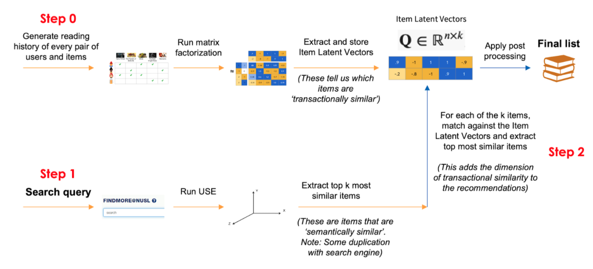

# Q-recsys (Query-based recommender system)

This library allows you to query the most transactionally similar item using semantic information based on a list of users, items and user-item interactions.

It is beneficial that users of this repo are somewhat familiar with these concepts:
collaborative filtering, deep learning and nearest neighbours.

* [Requirements](#requirements)
* [Quick start](#quick-start)
* [How it works](#how-it-works)
* [Key features of algorithm](#key-features-of-algorithm)
* [Use cases](#use-cases)

## Requirements

* Python >= 3.4
* C++ compiler to install `implicit`. See [here](https://github.com/benfred/implicit#installation)
for more details.

We recommend installing the dependencies using conda:

```bash
conda create -n qrecsys python==3.7
pip install -r requirements.txt
```

## Quick start

1. Prepare `users.csv`, `items.csv`, and `interactions.csv` files. These CSV files require these formats:

    `users.csv`

    ```text
    id
    0
    1
    2
    ```

    `items.csv` (note that the `title` column must be present):

    ```text
    id,title
    0,machine learning
    1,financial markets
    2,sleep deprivation
    3,sustainable environment
    ```

    `interactions.csv` (note that the user and item are IDs defined in `users.csv` and `items.csv` respectively)

    ```text
    user,item,interaction
    1,0,1
    2,2,1
    0,3,1
    ```

    Alternatively, you can just make use of the sample `users.csv`, `items.csv` and `interactions.csv` files
    under `samples/`.

2. Run the following:

    Import the relevant function and class.

    ```python
    >>> from qrecsys import preprocess, Recommender
    ```

    Preprocess the data and serialise the embeddings.

    ```python
    >>> preprocess(path_interactions="interactions.csv",
                   path_items="items.csv")
    ```

    To use our samples:

    ```python
    >>> preprocess(path_interactions="samples/interactions.csv",
                   path_items="samples/items.csv")
    ```

    Instantiate the recommender (it will look for the serialised data files). Then recommend items based on a query.

    ```python
    >>> recommender = Recommender(path_interactions="interactions.csv",   # or samples/interactions.csv
                                  path_items="items.csv")  # or samples/items.csv
    >>> recommender.recommend("politics")
    ['Contentious politics',
    'Globalisation, environment and social justice : perspectives, issues and concerns',
    'The will to improve : governmentality, development, and the practice of politics',
    'New state spaces : urban governance and the rescaling of statehood',
    'Shadows in the forest : Japan and the politics of timber in Southeast Asia']
    ```

## How it works

The whole process can be divided into 2 stages.



**Stage 0: Create title embeddings**

The first stage is attributed to `qrecsys.process`.

Every item is first encoded as two vector representations: the *semantic embedding* and *transactional embedding*. Then, these representations are
serialised for use in the next step 1.

Semantic embeddings are found by encoding the title of every item using Universal Sentence Encoder (USE). We use the USE encoder from TF Hub, trained on various data sources. The size of this embedding is 512.

Transactional embeddings are the latent representations found by matrix factorisation (MF), a common collaborative filtering technique. The size of the latent representation can be set in the `qrecsys.process` as the `embeds_mf_dim`. If you have a large number of items (>1M), we recommend setting the size of embedding to a higher number (eg. 256 or 512).

**Step 1: Querying**

This stage is attributed to `qrecys.Recommender`. Here is what happens in the querying stage:

1. Read the serialised vector representations. This is done when a new instance of `Recommender` is created.
2. In `Recommender.recommend`, the query is first semantically encoded using USE. Then we find the `K_use` most similar items in the semantic embedding space.
3. For ever USE vector, we fetch `K_mf` most similar items in the MF embedding space.
4. Finally, we return `n_to_recommend` items to the user.

Note that there will be cases where similar items found in the USE space are mapped to items in the MF space that have not been interacted before (these vectors are 0). In this cases, we set `use_buffer_multiplier` and `mf_buffer_multiplier` can be increased accordingly so that we avoid this problem.

## Key features of algorithm

* **Transactional similarity** Similar items based on users reading history
* **Semantic similarity** Similar items based on semantics of title
* **Implicit feedback** User interactions do not explicitly indicate that the user 'liked' it, rather representing a transaction
