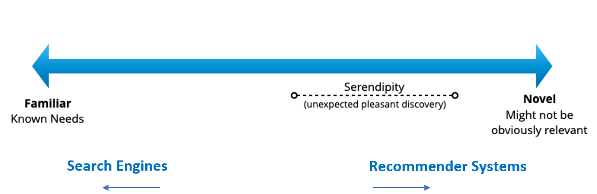
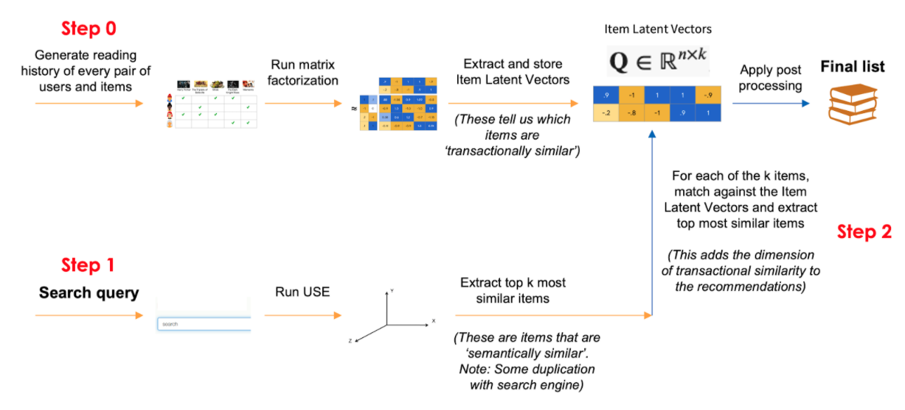

# Background and use cases

This is an open-source implementation of a search-based recommender system model that AI Singapore originally developed for the National University of Singapore Libraries. 

When a user submits a query to a search engine, a list of alternative recommended items will be returned in real time on top of the default search results, thereby providing a greater diversity of choices to the user.

The model learns from the following information:
1) Current search term’s linguistic features
2) Titles/descriptions of items in the database
3) Historical transactions between every user and item


## Use cases

The approach shared here can be used by anyone who wishes to extend their web/app search engine functionality through providing additional and insightful item recommendations on top of their search results. 

The recommender system can be triggered when the search term is entered, and the list of items can be displayed alongside the search results.

In the context of NUS Libraries, items refer to books/articles/e-resource titles, and transactions refer to borrowings/ downloads. In other contexts, items could refer to products and transactions could refer to purchases. 

Recommender systems play a different but complementary role to search engines, in that they are designed to uncover items that are less explicit matches, but could be novel or pleasant discoveries for the user. This exposes users and customers to more varied choices that still retain relevance, thereby increasing interest and engagement.



# Novella (our search-based recommender system)

The model source code and a sample (anonymised) training dataset are provided in this library.

The objective of the model is to generate a list of items that takes into account semantic similarity to the search term, whilst extending it to items with high transactional similarity. 

Note that we use the terms 'transactions' and 'interactions' interchangeably.

The inputs to the model are:
- List of users
- List of items with textual titles/descriptions
- Table of historical user-item interactions

It would be beneficial if users of this library have a working understanding of these concepts: collaborative filtering, deep learning language models, and nearest neighbours.

* [How it works](#how-it-works)
* [Requirements](#requirements)
* [Using the library](#using-the-library)


## How it works

The recommender system combines the following 2 ideas:

* **Semantic similarity** - Similar items can be found based on the natural language characteristics of their titles/descriptions
* **Transactional similarity** - Similar items can be found based on the transactions of other users who have items in common

Schematic of how the model works:



The process can be divided into 2 stages as follows.

**Stage 0: Creating semantic and transactional item embeddings**

The first stage is attributed to `qrecsys.process` function.

Every item in the database is first encoded into two vector representations: its semantic embedding and transactional embedding. Then, these representations are serialised and stored for use in the next stage. It is recommended to refresh the representations periodically.

**Semantic embeddings** are found by encoding the textual title/description of every item using Google's Universal Sentence Encoder (USE). 

We use the implementation of the USE encoder from [TF Hub](https://tfhub.dev) (this will be downloaded when you call `process`), which has been pre-trained on extensive data sources. The size of this embedding is 512. 

For example, here is the embedding for the title `Problem solving in analytical chemistry` (first item in `samples/users.csv`), truncated to the first 10 dims for illustration:

```
array([[ 6.64e-02, -7.70e-02,  2.66e-02,  2.28e-02,  6.38e-03, -6.71e-02,
        -5.27e-02, -5.45e-02,  8.83e-03,  5.14e-02, -5.92e-02, -1.17e-02,
       ...
       ], dtype=float32)
```

**Transactional embeddings** are the latent representations found by matrix factorisation (MF), a common collaborative filtering technique designed to uncover hidden relationships among items based on shared interactions by users. 

The input data is the table of historical user-item interactions. We first format the interactions data into a sparse matrix. Then, we model it using a Weighted Alternating Least Squares optimiser, giving us a latent representation for every item. 

The size of this representation can be set in the `qrecsys.process` as the `embeds_mf_dim`. If you have a large number of items (>1M), we recommend setting the size of embedding to a higher number (eg. 256 or 512). 

Here is an example of an MF embedding for the title `Problem solving in analytical chemistry`:

```
array([ 1.17e-04,  3.14e-04, -5.00e-05, -1.21e-04,  1.19e-04, -1.43e-04,
       -5.16e-05,  3.34e-04], dtype=float32)
```

Note that an MF embedding will be 0's if no user has interacted with it.

**Stage 1: Generating recommendations**

This stage is attributed to `qrecys.Recommender`. Here is what happens in the querying stage:

1) Read the serialised vector representations created in Stage 0. This is done when a new instance of `Recommender` is created.
2) In `Recommender.recommend`, the incoming query is first semantically encoded using USE. Then we find the `K_use` most similar items in the semantic embedding space.
3) For every USE vector, we fetch `K_mf` most similar items in the MF embedding space.
4) Finally, we return `n_to_recommend` items to the user.

Note that there will be cases where similar items found in the USE space are mapped to items in the MF space that have not been interacted with before (these vectors are 0's). In such cases, `use_buffer_multiplier` and `mf_buffer_multiplier` can be increased accordingly to avoid this problem.


## Requirements

* Python >= 3.4
* C++ compiler is needed to install `implicit`. See [here](https://github.com/benfred/implicit#installation)
for more details. Note that if you have OpenBLAS or MKL installed, it is recommended to set the number of threads to 0 for optimal performance, as mentioned [here](https://github.com/benfred/implicit#optimal-configuration).

We recommend installing the dependencies using conda:

```bash
conda create -n qrecsys python==3.7
pip install -r requirements.txt
```


## Using the library

1) Prepare `users.csv`, `items.csv`, and `interactions.csv` files (for trial purposes, you can also make use of the sample files provided
    under `samples/` and skip this part). These CSV files require these formats:

    `users.csv`

    ```text
    id
    0
    1
    2
    ```

    `items.csv` (note that the `title` column must be present):

    ```text
    id,title
    0,machine learning
    1,financial markets
    2,sleep deprivation
    3,sustainable environment
    ```

    `interactions.csv` (note that the user and item are IDs defined in `users.csv` and `items.csv` respectively):

    ```text
    user,item,interaction
    1,0,1
    1,0,1
    2,2,2
    0,3,1
    ```

    Every line must be an instance of an interaction. For the above example, we have 4 transactions:
    * user `1` interacted with item `0` once
    * user `1` interacted with item `0` once
    * user `2` interacted with item `2` twice
    * user `0` interacted with item `3` once

    Note that it is fine to repeat transactions (like the first 2 lines) as they will be aggregated.

2) Run the following:

    Import the relevant function and class.

    ```python
    >>> from qrecsys import preprocess, Recommender
    ```

    Preprocess the data and serialise the embeddings.

    ```python
    >>> preprocess(path_interactions="interactions.csv",  # or samples/interactions.csv
                   path_items="items.csv")  # or samples/items.csv
    ```

    Instantiate the recommender (it will look for the serialised data files). Then recommend items based on a search query.

    ```python
    >>> recommender = Recommender(path_interactions="interactions.csv",   # or samples/interactions.csv
                                  path_items="items.csv")  # or samples/items.csv
    >>> recommender.recommend("latent heat")  # if you are using our samples
    ['Convective heat transfer',
    'Procedures for simulating the performance of components and systems for energy calculations',
    'Roman power : a thousand years of empire',
    'The last generation of the Roman Republic',
    'Satoyama--satoumi ecosystems and human well-being : socio-ecological production landscapes of Japan']
    ```
Note that the dataset provided in this library is for trial purposes, and has been downsampled significantly from the original training dataset. Please treat the results of any model trained on this sample dataset as purely illustrative. 

To implement the solution for their use case, interested users should compile their own training dataset following the structure explained above.


# Contributors

- Raimi Karim, David Chong, Bai Yaguang, Anand Natarajan and Kevin Oh of AI Singapore.
- Mrs Lee Cheng Ean, Cheng Eng Aun, Tan Poh Lay and Ravi Kotaru of NUS.

# Acknowledgments

This project is supported by the National Research Foundation, Singapore under its AI Singapore Programme (AISG-RP-2019-050). Any opinions, findings and conclusions or recommendations expressed in this material are those of the author(s) and do not reflect the views of National Research Foundation, Singapore.

# Contributing

See any problems or have any feedback? Submit an issue and/or a PR 🤗!
